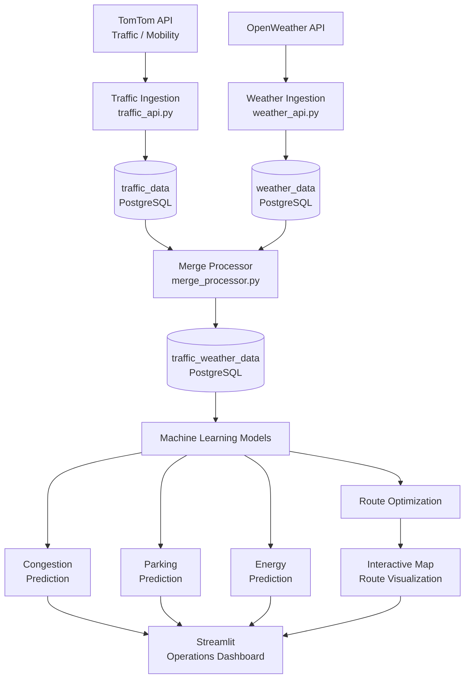

#  Smart City Operations

An end-to-end **Smart City Operations and Intelligence Platform** designed to monitor urban mobility, parking, weather, and energy conditions in near real time and generate machine-learning-based operational insights.

The system integrates live APIs, PostgreSQL, data processing pipelines, machine learning models, and an interactive Streamlit dashboard into a unified architecture.

---

##  Project Overview

Modern cities generate large volumes of data from traffic networks, parking facilities, weather services, and energy infrastructure.

This project demonstrates how these heterogeneous data sources can be integrated into a single intelligent operations platform.

The current system focuses on four major operational areas:

- 🚦 **Traffic & Mobility Intelligence**
- 🌦️ **Weather-Aware Traffic Analysis**
- 🅿️ **Smart Parking Analytics**
- ⚡ **Smart Energy Operations**

The platform continuously collects data, processes it, stores it in PostgreSQL, applies machine learning models, and presents operational insights through an interactive dashboard.

---

##  Key Objectives

- Integrate real-time urban data from external APIs
- Build automated data ingestion pipelines
- Store structured operational data in PostgreSQL
- Combine traffic and weather information
- Predict traffic congestion
- Perform traffic-aware route optimization
- Monitor and forecast parking occupancy
- Estimate parking availability and time-to-full
- Forecast electricity demand
- Detect potential peak-load conditions
- Forecast EV charging demand
- Provide a centralized operational dashboard
- Build a modular architecture that can be extended with additional smart-city services

---

#  System Architecture

# Running the Project

Start the components locally:  
python -m ingestion.traffic_api  
python -m ingestion.weather_api  
python -m database.merge_processor  
python -m synthetic.parking_live_updater  
python -m energy.energy_generator  

Then launch the dashboard locally:  
python -m streamlit run dashboard\final_dashboard.py

## 📊 Interactive Operations Dashboard

The project uses **Streamlit** to provide a centralized operations dashboard.

### 🚦 Mobility

- Traffic conditions
- Congestion predictions
- Route conditions
###  🗺️ Route Optimization & Map Visualization
A major component of the platform is the traffic-aware route optimization system.
The system evaluates route conditions and uses traffic and congestion information to support route selection between locations.
Key Capabilities
- Source and destination based route generation
- Alternative route evaluation
- Traffic-aware route analysis
- Congestion-aware route selection
- Route condition comparison
- Optimized route identification
- Visual route representation on maps
The optimized routes can be visually displayed on a map, allowing users to understand the selected route and compare route conditions geographically.
### Route Optimization Workflow

Source  
↓  
Destination  
↓  
Route Generation  
↓  
Traffic / Congestion Analysis  
↓  
Route Condition Evaluation  
↓  
Route Optimization  
↓  
Map Visualization

### 🅿️ Parking

- Current occupancy
- Predicted occupancy
- Available spaces
- Time-to-full

### ⚡ Energy

- Current demand
- Next-hour demand
- Solar generation
- EV charging demand
- Renewable contribution
- Transformer load
- Streetlights
- Power outages
- Peak-load prediction

### 🌦️ Weather

- Weather-aware operational information
- Traffic-weather integration
- Weather-aware operational information
- Traffic-weather integration

